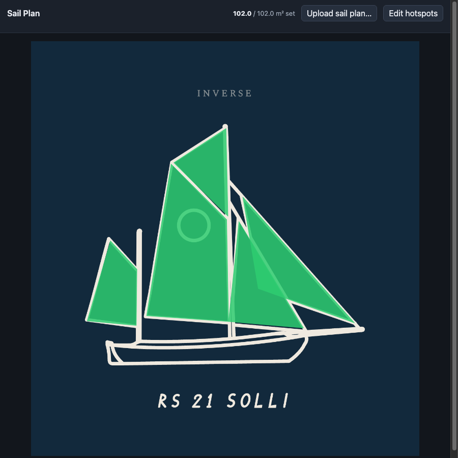
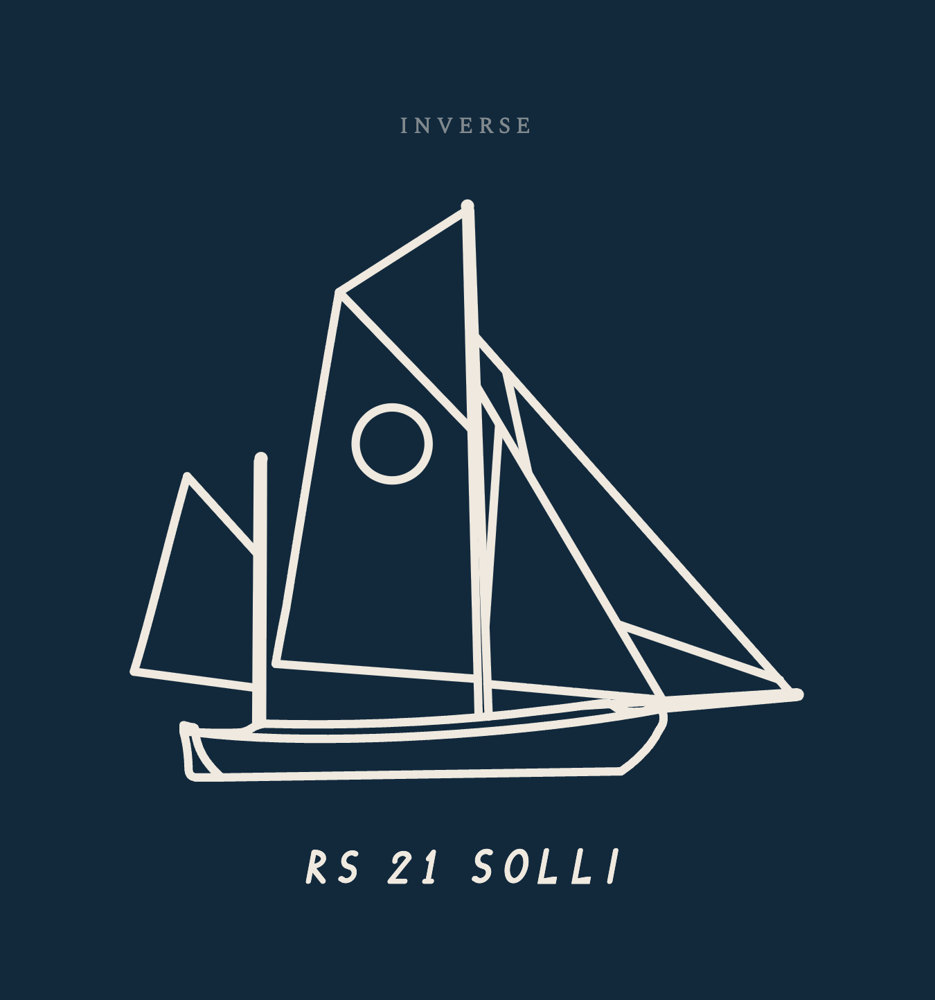

# signalk-sailplan-ui

Upload a sail plan diagram, trace a clickable hotspot over each sail (and each reef state), and tap a hotspot to tell Signal K which sails are currently set — no menus, no forms while you're on the helm.



*A gaff ketch (jib, foresail, mainsail, topsail, mizzen) with every sail set — the header reads the live computed area from `sailsconfiguration`. This is the sail plan diagram you'd upload:*



## How it fits together

This plugin only owns two things: the uploaded image, and the geometry of the hotspots drawn over it. It does **not** track sail state itself — that's the job of [`@signalk/sailsconfiguration`](https://github.com/SignalK/sailsconfiguration), which must also be installed. Clicking a hotspot here PUTs directly to that plugin's REST API, and the sail's real-time active/reef state comes back from its Signal K paths (`sails.inventory.*`, `sails.area.*`).

```
you click a hotspot  →  PUT /plugins/sailsconfiguration/sails/:id/active
                          PUT /plugins/sailsconfiguration/sails/:id/reducedState
                     ←  sails.inventory.<id> (active, reducedState) via Signal K deltas
                     ←  sails.area.total / sails.area.active (computed sail area currently set)
```

## Features

- Upload a sail plan as PNG, JPG, or SVG
- Trace a polygon hotspot for each sail, and for each reef point on that sail (e.g. "Main – full", "Main – reef 1", "Main – reef 2")
- Hotspots pull the sail list live from `sailsconfiguration`'s configured inventory — any number of sails, any names
- Click a hotspot to set that sail active at that reef level; click it again to stow it
- Active/reefed hotspots fill solid so each sail clearly reads as a pressed button, with a hover state on every hotspot
- Live header readout of total sail area currently set vs. total inventory area (from `sailsconfiguration`'s own calculation)
- Polls sail state on an interval so the display stays in sync with changes made elsewhere (e.g. NMEA input, another app)

## Install

Both plugins need to be enabled in Signal K's Plugin Config screen after installing:

```bash
cd ~/.signalk
npm install @signalk/sailsconfiguration signalk-sailplan-ui
```

Or install both from the Signal K App Store (search "Sails Configuration" and "Sail Plan UI"), then restart the server.

1. Enable **Sails Configuration** and define your sail inventory (id, name, type, area, reef areas).
2. Enable **Sail Plan UI**.
3. Open the "Sail Plan" webapp from the Signal K webapps list.

## Using it

**Upload sail plan…** — pick a PNG/JPG/SVG diagram of your boat's sail plan.

**Edit hotspots** — click points on the image to trace a sail's outline (minimum 3), pick which sail it represents and its reef level (0 = full sail), give it a label, and press "Add hotspot". Repeat for every sail, and for every reef state you want to be able to select directly (each reef level is its own traced shape, since that's usually how a sail plan diagram draws them). Press "Save hotspots" when done.

Leaving edit mode returns to the normal view: click a hotspot to set that sail/reef state, click it again to stow the sail.

## Configuration

| Setting | Default | Description |
|---|---|---|
| `sailsConfigPluginId` | `sailsconfiguration` | Plugin id of the installed sail state provider, in case you run a fork or a renamed install of `@signalk/sailsconfiguration`. |
| `pollInterval` | `4` | Seconds between re-reading sail state to refresh the highlighted hotspots. |

## License

ISC
